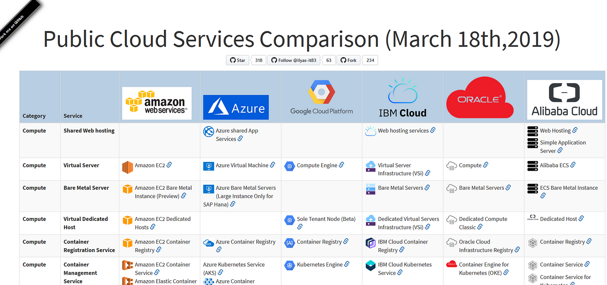
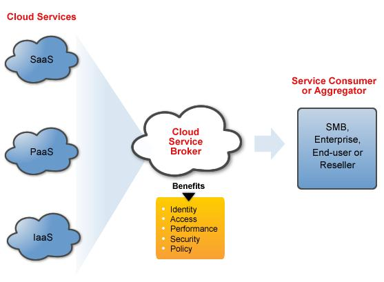
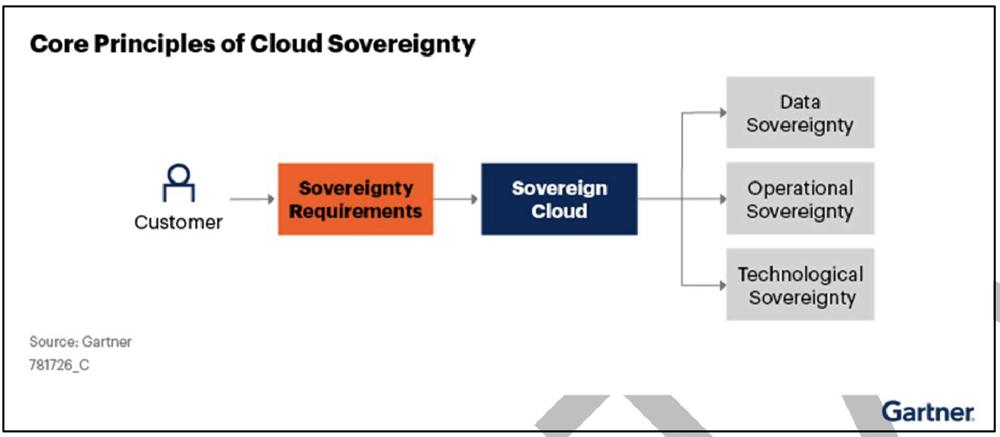

# 1. Cloud Provider

[Source](https://kyleake.medium.com/cloud-comparer-a-public-cloud-comparison-ilyes-68d1d9772a7a)

---
# 2. Cloud Broker
A arquitetura de referência do NIST, SP 500-292, define um Cloud Broker como "uma entidade que gerencia o uso, o desempenho e a entrega de serviços em nuvem e negocia relacionamentos entre provedores de nuvem e consumidores em nuvem." 

Features:
- Único ponto de entrada para gerenciar vários serviços em nuvem. 
- Intermediação e orquestração.
  -  Gerenciamento de acesso a serviços em nuvem, gerenciamento de identidades, relatórios de desempenho, segurança aprimorada, etc.
- Agregação: Um Cloud Broker combina e integra vários serviços em um ou mais novos serviços.
 - Serviço de suporte técnico (agregação, arbitragem e intermediação técnica), com foco principal no tratamento de problemas de interoperabilidade entre vários Provedores.

[Source](https://www.openpr.com/news/1245226/cloud-service-brokerage-market-growth-analysis-by-accenture-doublehorn-jamcracker-ibm-hpe-rightscale-dell-and-many-more.html)

--- 
# 3. Soberania de Dados

## 3.1 Motivadores:

Segundo a IN Nº 5, DE 30 DE AGOSTO DE 2021

"Art. 11. Antes de transferir serviços ou informações para um provedor de serviço de nuvem, os órgãos ou as entidades deverão, no mínimo:

IV - utilizar, para os sistemas estruturantes, somente os modelos de implementação de nuvem privada ou de nuvem comunitária, desde que restritas às infraestruturas de órgãos ou de entidades;"

---

"Art. 17. Em relação ao tratamento da informação em ambiente de computação em nuvem, o órgão ou a entidade, além de cumprir as orientações contidas na legislação sobre proteção de dados pessoais, deve observar as seguintes diretrizes:

I - **informação sem restrição de acesso poderá** ser tratada em ambiente de nuvem, considerada a legislação e os riscos de segurança da informação;

II - informação classificada em grau de sigilo e documento preparatório que possa originar informação classificada **não poderão ser tratados em ambiente de computação em nuvem**;"

Fonte: https://www.in.gov.br/en/web/dou/-/instrucao-normativa-n-5-de-30-de-agosto-de-2021-341649684

--- 

## 3.2 Soberania de dados

Conceito: “o aprovisionamento de serviços de nuvem dentro de uma jurisdição, atendendo requisitos de residência dos dados e autonomia operacional. É projetada para garantir que dados e infraestrutura estejam livres do controle por jurisdições externas e protegidos do acesso por governos estrangeiros”.

Pontos estruturantes da soberania de dados:
- Isolamento
- Territorialidade
- Prevalência da legislação brasileira
- Continuidade de negócio

### 3.3 Estratégico de multinuvem on premises - Dataprev

Plano de negócios (PN 2024-2028):

“Dataprev vai buscar uma ampliação da infraestrutura existente (nos recursos de processamento, armazenamento e redes), e adotar uma estratégia multinuvem para o próximo ciclo”.

Ainda dentro do PEI, com foco no Plano Diretor de Tecnologia, Informações e Comunicação (PDTIC 2024-2028), a Dataprev deve inovar através de um novo modelo de Multinuvem Soberana, ao “consolidar o novo modelo de nuvem de governo, que se baseia na parceria com fornecedores, permitindo a operação integrada ao ambiente da Dataprev, e garantir altos níveis de soberania.”

---

### Workload sem restrição: 

- [ ] Isolamento
- [x] Territorialidade
- [x] Prevalência da lesgilação brasileira
- [ ] Continuidade de Negócio

Poderá ser tratado em ambiente de nuvem pública.

---

### Workload com restrição: 

- [x] Isolamento
- [x] Territorialidade
- [x] Prevalência da lesgilação brasileira
- [x] Continuidade de Negócio

Necessariamente deverá ser tratado em ambiente de nuvem privado.